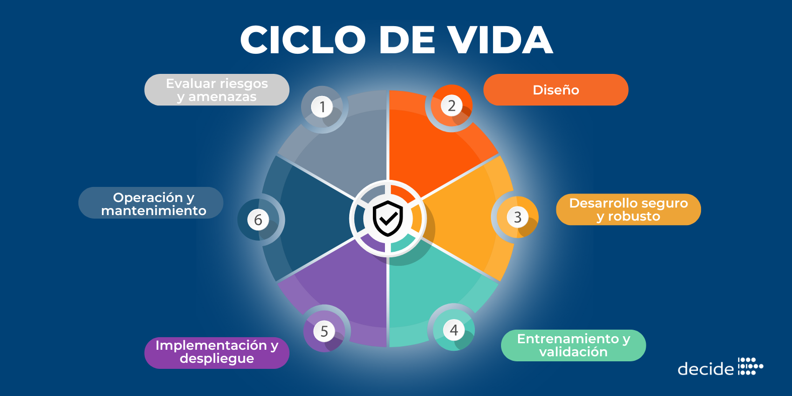

# **Ejercicio 1º**

## *¿Qué es un programa informático?*

Un programa informático o programa de computadora es un algoritmo (secuencia precisa, finita y ordenada de instrucciones para la resolución de un determinado problema) traducido a un lenguaje de programación de modo que un ordenador es capaz de ejecutarlo.

## *Diferencias entre código fuente, código objeto y código ejecutable.*

1. *Código fuente*  

El código fuente de un programa informático (o software) es un lenguaje de programación que le indican a una computadora cómo debe funcionar un programa o sitio web.

2. *Código objeto*  

El código objeto es una versión intermedia del código fuente que ha sido compilada a un formato binario, pero aún no es ejecutable directamente. Es el resultado de la compilación del código fuente antes de convertirse en código ejecutable.

3. *Código ejecutable*  

El código ejecutable es un archivo binario que puede ser ejecutado directamente por el sistema operativo. Este archivo es el resultado final de la compilación (y, en algunos casos, el enlace) del código fuente.

## *Etapas del desarrollo del software.*

El ciclo de vida de un software (sdlc) representa el proceso que cubre todas las fases de su evolución, desde la idea, hasta su desarrollo y mantenimiento, y cada una de estas etapas contribuye a que el producto final cumpla con las expectativas de los usuarios.
Generalmente el ciclo de vida de un software se divide en 7 etapas principales:

1. *Planificación*: Se definen los objetivos del proyecto, el alcance, los plazos, el presupuesto y los recursos necesarios.

2. *Análisis*: Se recopilan y estudian en detalle las necesidades del usuario y del cliente para saber exactamente qué debe hacer el sistema.

3. *Diseño*: Se planifica la arquitectura técnica, la interfaz, la base de datos y cómo se van a organizar los componentes del software.

4. *Desarrollo (o Codificación)*: Los programadores escriben el código fuente para convertir los diseños en un producto funcional.

5. *Pruebas (o Testing)*: Se revisa el software a fondo para encontrar y corregir errores, asegurando que funcione bien y cumpla con lo pedido.

6. *Implementación (o Despliegue)*: El sistema se instala y se pone en marcha en el entorno real para que los usuarios finales puedan empezar a usarlo.

7. *Mantenimiento*: Es una fase continua donde se actualiza el programa, se corrigen fallos nuevos y se añaden mejoras con el tiempo.

  
  
  

## *Enlace al repositorio*

https://github.com/santiaguin-13/1DAMV_GonzalezGarcia_Santiago.git

### *Bibliografía*

https://es.wikipedia.org/wiki/C%C3%B3digo_fuente

https://www.studocu.com/es/document/instituto-de-educacion-secundaria-poligono-sur/matematicas-ii/13codigos-fuente-objeto-y-ejecutable/104853597?sid=b21b2b2e-a145-4fd3-8568-f4609c18570e1790197810

INTRODUCCION A LA COMPUTACION (6ª ED.)
PETER NORTON , MCGRAW-HILL / INTERAMERICANA DE MEXICO, 2006

INGENIERIA DEL SOFTWARE (7ª ED.)
ROGER PRESSMAN , MCGRAW-HILL, 2010

https://www.universitatcarlemany.com/actualidad/blog/ciclo-de-vida-de-un-software

https://global.tiffin.edu/blog/cuales-son-las-etapas-del-desarrollo-de-software

https://www.microsoft.com/es-es/power-platform/topics/phases-of-the-software-development-lifecycle
